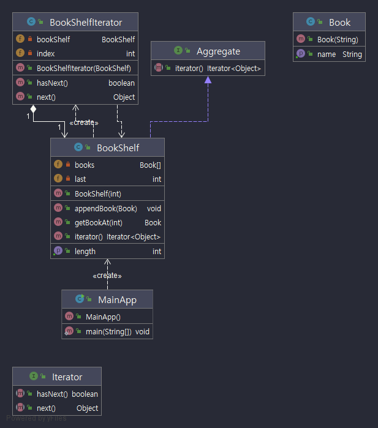

### 작성자
* 박대헌
> https://www.pdhstumus.com

 

## 이터레이터 패턴(iterator pattern)이란?

* 컬렉션 구현 방법을 노출시키지 않으면서도 그 집합체 안에 들어있는 모든 항목에 접근할 수 있는 방법을 제공한다.

 

* 이터레이터 패턴을 사용하면 모든 항목에 일일이 접근하는 작업을 컬렉션 객체가 아닌 반복자 객체에서 맡게 된다. 
이렇게 하면 집합체의 인터페이스 및 구현이 간단해질 뿐 아니라, 집합체에서는 반복작업에서 손을 떼고 원래 자신이 할 일(객체 컬렉션 관리)에만 전념할 수 있다.

 

* Aggregate : Aggregate의 역활
* Iterator : 하나씩 나열하면서 검색을 실행하는 인터페이스
* Book : 책을 나타내는 클래스
* BookShelf : 서가를 나타내는 클래스
* BookShelflterator : 서가를 검색하는 클래스
* MainApp : 동작 테스트용 클래스
  

* Iterator(반복자)의 역할
요소를 순서대로 검색해가는 인터페이스를 결정
다음 요소가 존재하는지를 얻기위한 hasNext()와 다음 요소를 얻기 위한 next()를 결정

* ConcreateIterator(구체적인 반복자)의 역할
Iterator가 결정한 인터페이스를 실제로 구현
이 역할은 검색하기 위해 필요한 정보를 가지고 있어야 한다.

* Aggregate(집합체)의 역할
Iterator역할을 만들어내는 인터페이스를 결정한다
이 인터페이스는 '내가 가지고 있는 요소를 순서대로 검색해 주는 사람'을 만들어 내는 메소드

* ConcreateAggregate(구체적인 집합체)의 역할
Aggregate역할이 결정한 인터페이스를 실제로 구현하는 일을 한다
구체적인 Iterator 역할, 즉 ConcreteIterator역할의 인스턴스를 만든다
 

## 결과 - 적용해서 얻는 결과

* iterator를 사용함 으로써 구현과 분리해서 하나씩 셀 수 있다

 

> 연관 패턴

Visitor패턴 : 많은 것이 모여 있는 내부를 돌아다니면서 같은 처리를 반복 적용해가는 패턴

Composite패턴 : Composite패턴은 재귀적인 구조를 갖는 페턴

Facory Method 패턴 : iterator메소드가 iterator 인스턴스를 작성할 때 Factory method 패턴이 사용되는 경우 가 있다.
