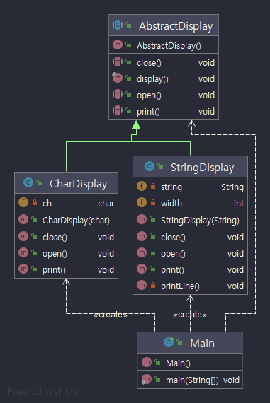

### 작성자
* 박대헌

 

## 템플릿 메서드 패턴(iterator pattern)이란?

* 상위 클래스 쪽에 템플릿에 해당하는 메소드가 정의가 되어 있고 메소드의 정의안에는 추상 메소드가 사용 된다.

* 추상 메소드를 실제로 구현 하는것은 하위 클래스 , 즉 상위클래스 에서 뼈대를 구성하고 하위 클래스에서 구체적인 내용을 결정하는 디자인 패턴

* 이터레이터 패턴을 사용하면 모든 항목에 일일이 접근하는 작업을 컬렉션 객체가 아닌 반복자 객체에서 맡게 된다. 
이렇게 하면 집합체의 인터페이스 및 구현이 간단해질 뿐 아니라, 집합체에서는 반복작업에서 손을 떼고 원래 자신이 할 일(객체 컬렉션 관리)에만 전념할 수 있다.

 

* AbstractClass(추상 클래스)의 역할
 AbstractClass는 템플릿 메소드를 구현하고  추상 메소드를 선언
 하위 클래스 ConcreateClass 역활에 의해 구현
 
* ConcreateClass(구현 클래스)의 역할
 AbstractClass 역할에서 정의되어 있는 추상 메소드를 구현
 여기에서 구현한 메소드는 AbstractClass역의 템플릿 메소드에서 호출
 

## 결과 - 적용해서 얻는 결과

* 로직을 공통화 할 수 있다. ex) 에디터의 복사 붙여넣기 기능을 사용 했을때 ConcreateClass를 많이 만들었다고 가정 : 버그가 났을때 구현 클래스를 모두 수정 해야함.
* 상위 클래스와 하위 클래스의 연계 
* 하위 클래스를 상위 클래스와 동일시한다 

 

> 연관 패턴

* Factory Method 패턴

Template Method 패턴을 인스턴스 생성에 응용한 전형적인 예가 Factory Method 패턴

* Strategy 패턴

Template Method 패턴에서는 '상속'을 이용해서 프로그램의 동작을 변경 -> 상위 클래스에서 큰 흐름을 결정하고 하위클래스에서 구체적인 흐름을 결정하고 있기 때문
Strategy 패턴에서는 '위임'을 이용해서 동작을 변경 -> 프로그램의 일부분을 변경하기 보다는 알고리즘 전체를 완전히 변경

